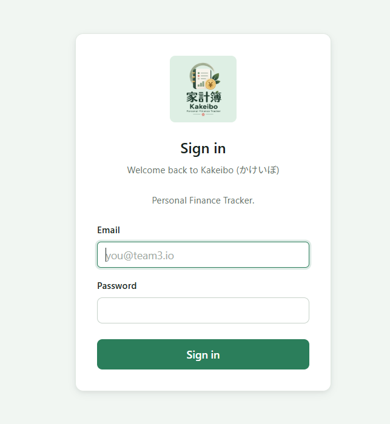
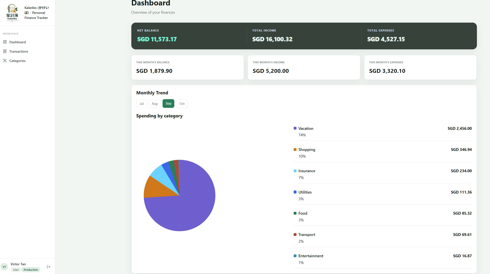
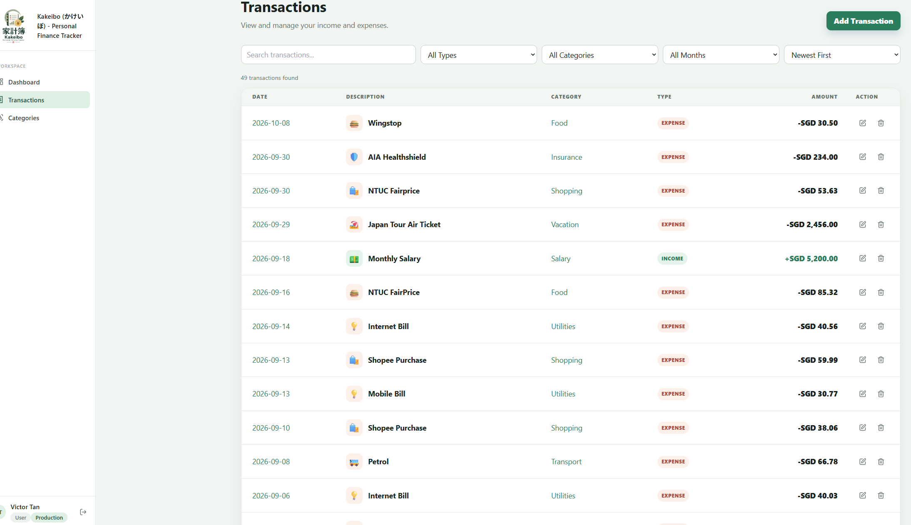
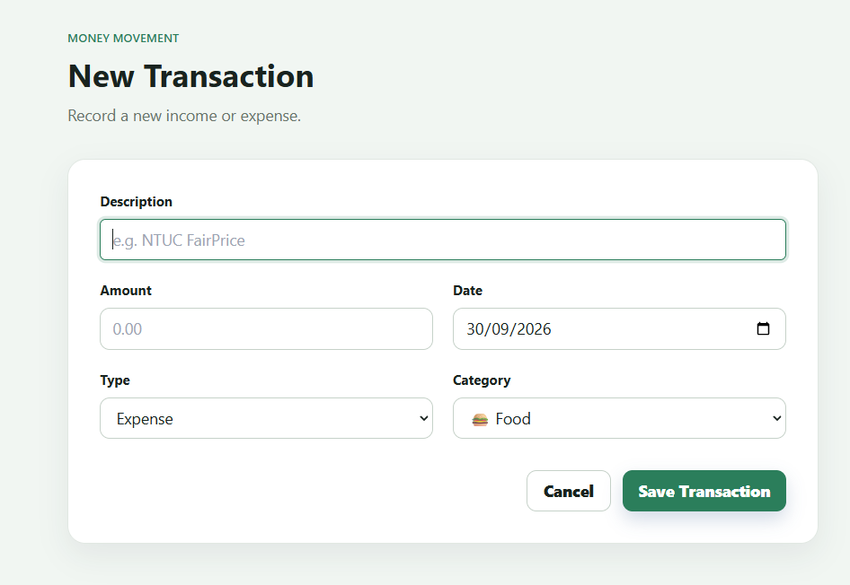
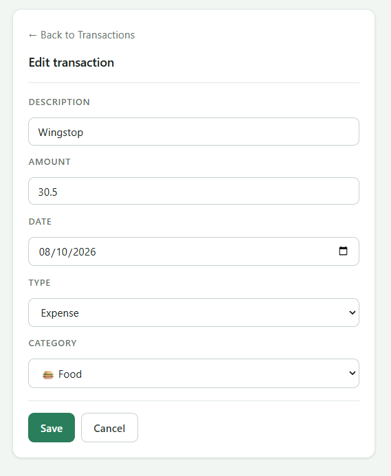
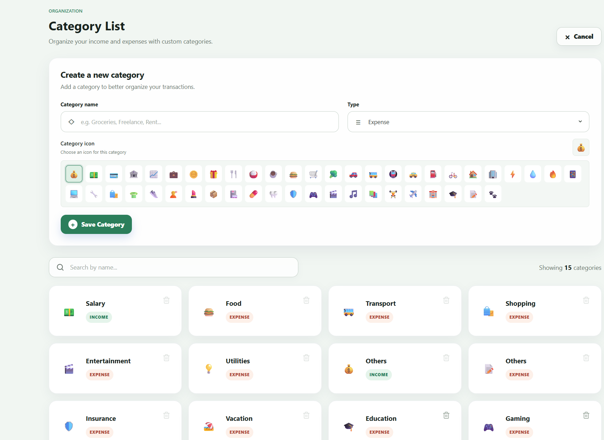
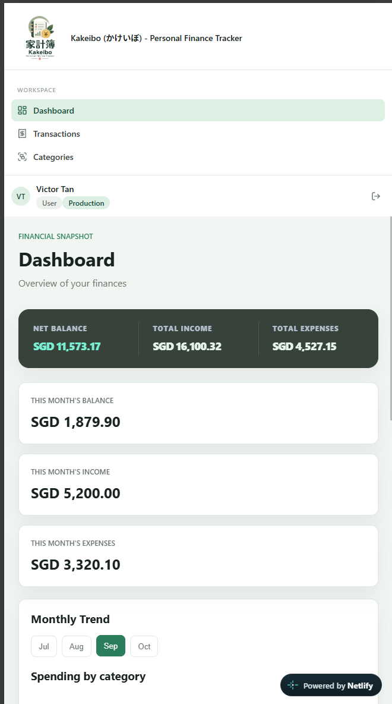
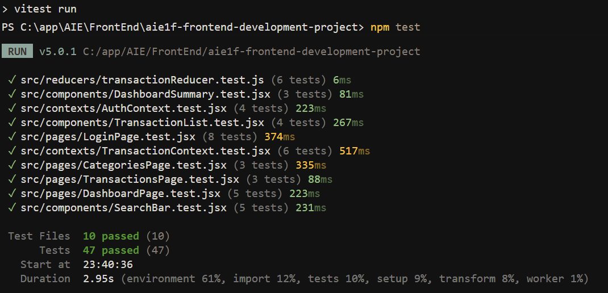

# Kakeibo (家計簿) — Personal Finance Tracker

Kakeibo is a React-based personal finance tracker for recording income and expenses, organising transactions by category, and reviewing spending activity through a simple dashboard and searchable transaction list.


## Problem Statement

Keeping track of day-to-day spending can become difficult when transactions are scattered across different places. Kakeibo provides a simple interface for users to:

- record income and expenses;
- organise transactions using custom categories;
- review monthly financial activity;
- search, filter and sort transaction history; and
- maintain category information used by transactions.

The target user is someone who wants a lightweight personal budgeting and expense-tracking tool without the complexity of a full accounting application.

## Main Features

- Dashboard summary of income, expenses and balance
- Transaction list with category, type, amount and date
- Add new transactions using a controlled form
- Edit existing transactions
- Delete transactions
- Search transactions by description
- Filter by transaction type, category and month
- Sort transactions by date or amount
- Category management
- Custom category emoji/icon selection
- Prevent deletion of categories that are already assigned to transactions
- Responsive layouts for selected views; full mobile-width support remains to be verified
- Loading and error handling for API operations
- Configurable API data source using local JSON Server or a hosted MockAPI endpoint

### Bonus Challenges: Easy & Medium

#### Easy

- [x] Search or sort on a list view
- [x] Spinner while async data loads
- [x] Responsive down to mobile screen widths

#### Medium

- [x] Edit an existing transaction
- [x] Mock authentication flow
- [x] Automated tests with React Testing Library
- [x] Optimistic UI updates for create, update and delete, including success, rollback and delete-order tests

### Demo Login Credentials

Authentication is mocked in the frontend for this school project; it is not production authentication.

| Email | Password |
|---|---|
| `victor@team3.io` | `password123` |
| `alex@team3.io` | `password123` |

## Technology Stack

| Technology | Purpose |
|---|---|
| React | Component-based user interface |
| Vite | Development and production build tooling |
| JavaScript | Application logic |
| React Router | Client-side routing and navigation |
| React Context API | Shared application state |
| `useReducer` | Transaction state management |
| `useState` / `useEffect` / `useMemo` | Local state, data fetching and derived state |
| Yup | Form validation |
| JSON Server | Local mock REST API backed by `data/db.json` |
| MockAPI | Optional hosted mock backend when configured with its API base URL |
| CSS Modules | Component/page styling |
| Lucide React | UI icons |
| Git / GitHub | Source control and team collaboration |
| Netlify | Public deployment — `https://aie1f-team-3-kakeibo.netlify.app` |

## Data Model

Kakeibo keeps categories separate from transactions. The transaction references a category using `categoryId`; the transaction type (`income` or `expense`) is defined by the category.

### Category

```json
{
  "id": "food",
  "name": "Food",
  "type": "expense",
  "icon": "🍴"
}
```

### Transaction

```json
{
  "id": "18",
  "date": "2026-09-19",
  "description": "Movie Ticket",
  "categoryId": "entertainment",
  "amount": 16.95
}
```

This avoids duplicating the transaction type in both the category and transaction records.

## Application Structure

The application is organised into pages, reusable components, context and reducer logic.

```text
src/
├── components/
├── contexts/
├── pages/
├── reducers/
├── App.jsx
└── main.jsx
```

Important application areas include:

- **Dashboard** — financial summary and recent activity
- **Transactions** — list, search, filter, sort, create, edit and delete
- **Categories** — list, search, create and guarded delete
- **TransactionContext** — shared transaction/category state and API operations
- **transactionReducer** — reducer actions for transaction state changes

## Backend / API

The app uses a configurable REST API base URL. For local development, use the included **JSON Server** and `data/db.json`. A hosted **MockAPI** endpoint can be used for a public demo by setting the same environment variable to that endpoint.

Resources:

```text
/categories
/transactions
```

The local API base URL is configured using a Vite environment variable:

```env
VITE_API_BASE_URL=http://localhost:3000
```

The application reads it with:

```js
export const API_BASE = import.meta.env.VITE_API_BASE_URL;
```

## Local Setup

### 1. Clone the repository

```bash
git clone https://github.com/magcal90/aie1f-frontend-development-project.git
cd aie1f-frontend-development-project
```

### 2. Install dependencies

```bash
npm install
```

### 3. Configure the local API environment variable

Copy the committed example file to `.env.local`:

```powershell
Copy-Item .env.example .env.local
```

The example config points to the local JSON Server at `http://localhost:3000`.

### 4. Start the local API

In one terminal, start JSON Server:

```bash
npm run server
```
This serves the `/categories` and `/transactions` resources from `data/db.json`.


In a separate terminal, start Veryfi Server
```bash
npm run receipt-api
```
This activates the receipt scanning service on local server.


### 5. Start the frontend

In a new terminal, run:

```bash
npm run dev
```

Open the local URL printed by Vite, usually `http://localhost:5173`.

### 6. Run tests and checks

```bash
npm test
npm run lint
npm run build
```

### 7. Preview the production build locally

```bash
npm run build
npm run preview
```

Vite prints the local preview URL in the terminal.

## Deployment

**Live application:** https://aie1f-team-3-kakeibo.netlify.app

Deployment platform: Netlify

Configure the following environment variable on the deployment platform before building:

```text
VITE_API_BASE_URL=https://YOUR-PROJECT.mockapi.io/api/v1
```

To run the VeryFi Receipt Scanner API - Create an account at https://www.veryfi.com and fill up these variables

```text
VERYFI_URL=https://api.veryfi.com/api/v8/partner/documents
VERYFI_CLIENT_ID=
VERYFI_USERNAME=
VERYFI_API_KEY=
```

## Screenshots
1. Login page   
 

2. Dashboard

3. Transaction list with search/filter controls

4. Add/Edit Transaction form

5. Edit Transaction form

6. Category List

7. Responsive layouts down to mobile widths​

8. Testing


## Team

- Ho Wai Hong
- Choo Yeow Hwee
- Prancia Toh Wai Yee

### Work Division

The following GitHub-handle ownership reflects the project workflow discussed during development. **Before submission, map each handle to the correct full name.**

| Member | GitHub handle | Main areas of contribution |
|---|---|---|
| Prancia Toh Wai Yee | `prantwy` | Dashboard, summary/derived state, recent transaction presentation, Responsive down to mobile screen widths |
| Choo Yeow Hwee | `magcal90` | Vite/app scaffold, routing/integration, transaction list, search/filter/sort, category management, API/environment integration, Optimistic UI updates for create/update/delete |
| Ho Wai Hong | `whho21` | Add Transaction controlled form, validation and create/POST flow |


## Git Workflow

The team used a shared GitHub repository with an integration workflow:

```text
main
  ↑
develop
  ↑
feature/*
```

Day-to-day work was done on feature branches and integrated through `develop` before moving stable work to `main`.

## Key Technical Decisions

### Shared state with Context + reducer

Transaction and category data are shared by multiple routes, so the application uses Context for access and a reducer for transaction state changes.

### Derived transaction type

A transaction stores only `categoryId`. The category defines whether the transaction is income or expense. This keeps one source of truth for transaction type.

### Local JSON Server and hosted API

Local development uses JSON Server with `data/db.json` so CRUD operations work without an external account. A hosted MockAPI endpoint can be configured for a public demo using `VITE_API_BASE_URL`.

### Environment-based API configuration

`VITE_API_BASE_URL` keeps the API location out of component code and allows the same source code to be used in local development and deployment.

### Optimistic UI

For create, update and delete, the UI changes immediately while the request runs. Successful requests confirm the server response; failed requests restore the prior state. Tests cover delayed success, rejected requests and delete rollback ordering. Temporary UI metadata such as `pending` stays in React state and is not sent to the API.

## Challenges and Learnings

### Challenges

- Integrating work from multiple feature branches
- Keeping shared transaction and category state consistent across routes
- Normalising category data so transaction type is derived from the category
- Preventing deletion of categories already used by transactions
- Coordinating API data returned by MockAPI with frontend state
- Designing rollback behaviour for optimistic create/update/delete operations
- Maintaining responsive and consistent styling across multiple pages

### Learnings

- Breaking a React application into smaller components and pages
- Using controlled forms and Yup validation
- Managing shared state with Context and `useReducer`
- Using `useEffect` for API data fetching
- Computing derived state for filtering, sorting and financial summaries
- Implementing client-side routing with React Router
- Using feature branches, rebasing and pull requests in a team workflow

## AI and Tools Disclosure

- **GitHub Copilot** — code completion, implementation suggestions and debugging support, explanation of React concepts, code review, data-model refinement
- **ChatGPT** Git workflow guidance, README/presentation drafting.


### External References / Adapted Material

- NTU PACE React lesson materials
- https://react.dev/reference/react
- https://lucide.dev/icons/

## Repository

https://github.com/magcal90/aie1f-frontend-development-project
